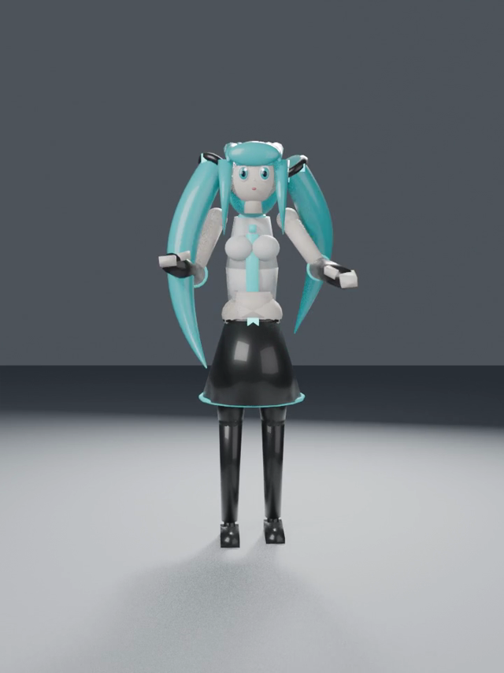

# ai-test-lab

用来测试 AI 各种效果的实验仓库（Playground）。

## 🎬 AI 生成动画

### miku_dance.mp4 —— Qwen 生成

[](https://mafeis.github.io/ai-test-lab/)

**▶ 点击封面直接观看** → [在线播放器](https://mafeis.github.io/ai-test-lab/) · [视频文件页](https://github.com/mafeis/ai-test-lab/blob/main/images/miku_dance.mp4)

📄 详细测试记录（制作过程 / 提示词 / 踩坑）：[experiments/miku-blender-dance](experiments/miku-blender-dance/) · 后续 H3 图生视频优化对比：[docs/miku-dance-optimize](docs/miku-dance-optimize.md)

> 注：GitHub README 出于安全策略会过滤 `<video>` 标签，无法在 README 内直接内嵌播放器，因此点击封面跳转到 GitHub Pages 播放页观看。

## 目录结构

```
ai-test-lab/
├── prompts/       # 提示词测试用例
├── code/          # AI 生成代码的效果测试
├── images/        # 图像生成 / 视觉理解测试
├── docs/          # 测试记录与对比结论
└── experiments/   # 各种实验性小项目
```

## 使用方式

- 每个测试一个独立子目录，附上 `README.md` 说明测试目标、输入和结果
- 测试结论记录在 `docs/` 下，方便横向对比不同模型 / 参数的效果

## 测试主题（可扩展）

- [ ] 提示词工程效果对比
- [ ] 代码生成与修复能力
- [ ] 长文本理解与摘要
- [ ] 图像生成效果
- [ ] Agent / 工具调用能力
